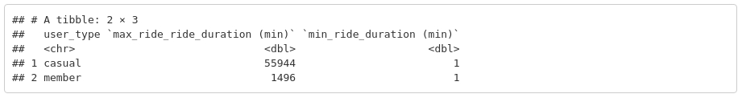
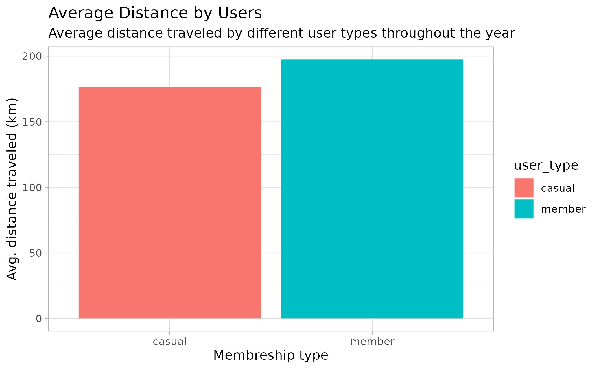

---

Title: 'Case Study: How does a bike-share company navigate speedy success'
Author: 'Rubayet Islam'
Date: '2022-05-22'
---

# Case study: How does a bike-share company navigate speedy success

**Author:** Rubayet Islam
**Date:** 2022-05-22


## Background

**Cyclistic:** A bike-share program that features more than 5,800 bicycles and 600 docking stations. Cyclistic sets itself apart by also offering reclining bikes, hand tricycles, and cargo bikes, making bike-share more inclusive to people with disabilities and riders who can't use a standard two-wheeled bike. The majority of riders opt for traditional bikes; about 8% of riders use the assistive options. Cyclistic users are more likely to ride for leisure, but about 30% use them to commute to work each day.

Customers who purchase single-ride or full-day passes are referred to as casual riders. Customers who purchase annual memberships are Cyclistic members. Cyclistic's finance analysts have concluded that annual members are much more profitable than casual riders.

Moreno (Director of Marketing) has set a clear goal: Design marketing strategies aimed at converting casual riders into annual members. In order to do that, however, the marketing analyst team needs to better understand how annual members and casual riders differ, why casual riders would buy a membership, and how digital media could affect their marketing tactics. Moreno and her team are interested in analyzing the Cyclistic historical bike trip data to identify trends.

## Step 1: Getting Information of The Task

### Business Task

To identify how do annual members and casual rider s use Cyclistic differently.

### Stakeholders

**Primary:** Lily Monero, Director of Marketing

**Secondary:** Cyclistic executive team (approves recommended marketing program)

## Step 2: Collection and Preparation of Data

### Data & Source Integrity

-   Data is stored in remote server [(url)](https://divvy-tripdata.s3.amazonaws.com/index.html) and provided by Motivate International Inc. and separated in chunks of querterly .csv files.

-   Data has been protected under data-privacy license mentioned here: [license](https://ride.divvybikes.com/data-license-agreement). This license states that this data has been provided "As is" as per bikeshares sole discretion. So reliability of the data can be vetted eventhough this has been provided by third party.

-   This data cannot be connected to the individual riders and their credit card numbers as unique rider ID has been used to record ride data.

### Observations

1.  There are 13 columns in the data files. These are: ride_id, rideable_type, started_at, ended_at, start_station_name, end_station_name, start_station_id, end_station_id, start_station, start_lat, start_lng, end_lat, end_lng, member_casual

2.  started_at and ended_at columns contains date-time data and formatted as YYYY-MM-DD HH:MM:SS format.

3.  start_station_id and end_station_id has discrepancy. Some of the IDs contain alphabets at the beginning (12 char length) and some contains only numbers (variable length 3-8).

4.  Although some of the csv files did not have start_station_name, start_station_id, end_station_name, end_station_id; these rows contain latitude and longitude data. This can be used to fill these empty values.

5.  member_casual column contains 2 types of membership data: member or casual.

## Step 3: Processing Data (Cleaning and Transformation)

### Tools Used

-   SQL (sqlite, DB Browser): To process and clean data for further analysis

-   R: To analyze and visualize data

### Cleaning and Transformation of Data

1.  All of the last 12 month's ride data has been separated month-wise in the server. For proper management all of the data chunks are combined in a single table named "cyclistic_trip_data"

2.  COUNT() function was run to check the row count of the aggregated data-set. There are 5757551 rows in this data-set.

```{sql eval=FALSE, include=FALSE}

SELECT 
    COUNT(*)
FROM 
    cyclistic_trip_data
    
```


3.  Since GPS (latitude and longitude) data can have similar fractional data of same location, this has been verified and transformed into average values and exported into csv file (avg_start_station, avg_end_station) and imported as avg_start_station and avg_end_station tables in the database for easier management of location data.

```{sql checking for multiple GPS data for same location, eval=FALSE, include=FALSE}

-- Checking for multiple GPS values of same location for start_station_name

SELECT
    start_station_name, 
    start_lat, 
    count(*)
FROM 
    cyclistic_trip_data
WHERE
    start_station_name is not NULL
GROUP BY
    start_station_name
    
```


Above mentioned procedure has been executed for the end_station_name column as well.

```{sql Calculating avg GPS data, eval=FALSE, include=FALSE}

-- Calculating average GPS values for start_station_name

SELECT
    start_station_name,
    start_staion_id,
    average(start_lat) AS start_lat_avg,
    average(start_lng) AS start_lng_avg,
FROM 
    cyclistic_trip_data
WHERE
    start_station_name is not NULL
GROUP BY
    start_station_name
    
```

Result obtained from this query was saved as a csv file (avg_start_station_gps.csv and avg_end_station_gps.csv) for later usage as table and join with the rest of the trip data.

4.  There has been some discrepancies regarding ride duration. Some of the ride durations came out negative (83 rows) and these were left out in the final cleaning query.

    

    Moreover, since there are full-day passes for casual riders, there has been 4198 entries of rides more than 24 hour duration and these were kept in the final processed data set.

    

5.  The previously collected trip data has been inner joined with avg_start_station and avg_end_station location data and exported to csv file for analysis using following SQL query:

```{sql Merging GPS data with the trip data for further analysis, eval=FALSE, include=FALSE}
-- Preparing and cleaning data for analysis and visualization

SELECT
	c.rideable_type,
	c.started_at, 
	c.ended_at, 
	round((JULIANDAY(c.ended_at)-JULIANDAY(c.started_at))*1440) as ride_duration_min,
	c.start_station_name,
	avg_s.start_lat_avg,
	avg_s.start_lng_avg,
	c.end_station_name,
	avg_e.end_lat_avg,
	avg_e.end_lng_avg,
	member_casual
FROM
	cyclistic_trips_data as c
INNER JOIN
	avg_start_station_gps as avg_s
	ON c.start_station_name = avg_s.start_station_name
INNER JOIN
	avg_end_station_gps as avg_e
	ON c.end_station_name = avg_e.end_station_name
WHERE
	ride_duration_min > 0
ORDER BY
	c.start_station_name ASC
```

Final cleaning of rows with blank cells have been done with R:

```{r Dropping rows with blank values, warning=FALSE}
library(tidyverse)

df <- read_csv('cleaned_trip_data_exported.csv')
cat('Total rows before dropping blanks: ', nrow(df))

df <- df %>%
  drop_na()
cat('Total rows after dropping blanks: ', nrow(df))

# Writing data to file for future use.
write.csv(df, 'cleaned_trip_data_working_copy.csv')
```

## Step 4: Analysis

### Importing Necessary Libraries

```{r Importing libraries, message=FALSE, warning=FALSE}
library(lubridate)
library(janitor)
library(skimr)
library(geosphere)
```

### Taking a Glimpse at the Data-frame

```{r Running glimpse()}
df <- df %>% 
  glimpse()
```


### Renaming Columns for Easier Understanding

```{r Renameing columns}
df <- rename(df, 
             user_type = member_casual, 
             bike_type = rideable_type)

glimpse(df)
```


### Basic Descriptive Analysis

```{r Minimum and maximum ride duration}
df_min_max_time <- df %>% 
  select(user_type, ride_duration_min) %>% 
  group_by(user_type) %>%
  summarize("max_ride_ride_duration (min)" = max(ride_duration_min), "min_ride_duration (min)" = min(ride_duration_min))

df_min_max_time
```



Since Cyclistic provides day passes, there are rides with more than 24 hour ride passes which are contributing in the higher value of max_ride_duration.

```{r Counting day passes}
df_day_passes <- df %>% 
  select(user_type, ride_duration_min) %>% 
  group_by(user_type) %>% 
  filter(ride_duration_min >= 1440) %>% 
  summarize(day_passes = n())

df_day_passes
```


#### Speculation

Casual riders use more day passes than the annual members.

### Average Ride Duration by Membership Types

```{r Average ride duration of membership types}
df_avg_time <- df %>% drop_na() %>%
  group_by(user_type) %>%
  summarize(average_ride_duration_mins = mean(ride_duration_min))

df_avg_time
```


#### Visualizing Average Ride Duration

```{r Average ride duration visualization}
ggplot(data = df_avg_time) + geom_col(mapping = aes(x = user_type, y = average_ride_duration_mins, fill = user_type)) + 
  labs(title = "Average Ride Duration", 
       subtitle = "Average ride durations by different membrship types", 
       x = "Membership types", 
       y = "Average ride duration (min)") + 
  theme_light()

```


#### Speculation

Casual riders spend twice as more time riding than the annual members.

### Weekday-wise Ride Counts of Different Members

```{r Weekday-wise ride counts}
df_weekly_count <- df %>% 
  group_by(day_of_week = wday(started_at, label = TRUE), user_type) %>% 
  summarize(no_of_rides = n())

weekly_ride_plot <- ggplot(df_weekly_count) +
  geom_line(mapping = aes(x = day_of_week, y = no_of_rides,
                          group = user_type, color = user_type)) +
  labs(title = "Weekly Ride Count",
       subtitle = "Weekly rides made by different membership types",
       x = "Day of week", y = "No. of rides") +
  theme_light()

weekly_ride_plot
```


#### Speculation

Through out the week causal riders use Cyclistic's service almost half the amount of annual members. However, during weekly holidays (Saturday and Sunday) this number surpass the weekly ride counts of annual members whereas, opposite trend is observed for annual members.

### Month-wise Ride Count by Membership Types

```{r Month-wise ride count}
df_monthly_count <- df %>% 
  group_by(month = month(started_at, label = TRUE), user_type) %>% 
  summarize(no_of_rides = n())

monthly_ride_plot <- ggplot(df_monthly_count) +
  geom_col(mapping = aes(x = month, y = no_of_rides, fill = user_type),
           position = "dodge") + labs(title = "Monthly Ride Count", subtitle = "Monthly rides made by different membership types", x = "No. of rides", y = "Months") + 
  theme_light()

monthly_ride_plot
```


#### Speculation

Number of rides made by both the casual riders and the annual members vary as per month. Such as, during winter casual riders are less likely to use bikes rather than the annual members. On the other hand, although both casual and annual members ride counts are higher during summer, casual riders are more likely to use bikes (June, July, August) compared to annual members.

### Hour-wise Ride Counts by Membership Types

```{r Hour-wise ride count}
df_hourly_count <- df %>% 
  group_by(hour_of_day = hour(started_at), user_type) %>% 
  summarize(no_of_rides_by_hour = n())

hourly_ride_plot <- ggplot(df_hourly_count) + 
  geom_line(mapping = aes(x = hour_of_day, y = no_of_rides_by_hour, 
                          group = user_type, color = user_type)) +
  labs(title = "Hourly Ride Count", subtitle = "Hourly rides made by different membership types", y = "No. of rides by hour", x = "Hour of day") +
  theme_light() + scale_x_continuous(breaks = c(0:23))

hourly_ride_plot
```


#### Speculation

It is clear that the spike at the hours 08 and 17 indicates that most of the annual members using Cyclistic service are the working people and using as their office rides whereas, a gradual increase of causal riders 16-18th hour of the day indicates general usage in the evening.

### Routes Taken by Different Membership Types

```{r Routes taken}
# Popular start stations for member types
df_routes_taken <- df %>% 
  count(user_type, start_station_name, sort = TRUE) %>% 
  head(10)

routes_plot_start <- ggplot(df_routes_taken) + geom_bar(mapping = aes(y = start_station_name, x = n, fill = user_type), stat = "identity") + 
  theme_light() + labs(x = "No. of trips started", y = "start station name")

routes_plot_start
```


```{r Popular end stations for member types}
# Popular end stations for member types
df_routes_ended <- df %>% 
  count(user_type, end_station_name, sort = TRUE) %>% 
  head(10)

routes_plot_end <- ggplot(df_routes_ended) + geom_bar(mapping = aes(y = end_station_name, x = n, fill = user_type), stat = "identity") + 
  theme_light() + labs(x = "No. of trips ended", y = "end station name")

routes_plot_end
```


#### Speculation

From the above plots it can be seen that Streeter Dr & Grand Ave has the largest casual rider gathering. This spot can be used to advertise for the annual membership.

### Preferred Choice of Bikes

```{r Bike choice by users}
df_bike_choice <- df %>% 
  select(user_type, bike_type) %>% 
  group_by(bike_type, user_type) %>% 
  summarize(count_of_bike = n())

ggplot(data = df_bike_choice) + geom_col(mapping = aes(x = bike_type, y = count_of_bike,
                                                       fill = user_type), position = "dodge") + 
  theme_light() + labs(title = "Choice of Bikes", 
                       subtitle = "Choice of bike types between rider types",
                       x = "Type of bikes", y = "No. of rider types using bike")
```


#### Speculation

Casual riders use all three types of bikes whereas annual members prefer classic bikes mostly.

### Distance Traveled by Different Riders

```{r Summarizing distance traveled by user types}
# Merging start and end station names to identify unique routes and no. of it's appearance in data set

df_distance <- df %>% 
  select(start_station_name, end_station_name, start_lat_avg, start_lng_avg, end_lat_avg, end_lng_avg, user_type) %>% 
  mutate(route_merged = paste(start_station_name, " to ", end_station_name)) %>% 
  group_by(route_merged) %>% 
  mutate(route_count = n())

# calculating distance from unique routes

df_distance_user <- df_distance[row.names(unique(df_distance[,c("route_merged")])),] %>% 
  group_by(user_type) %>%
  rowwise() %>% 
  summarize(user_type, distance_km = (distm(c(start_lat_avg, start_lng_avg), c(end_lat_avg, end_lng_avg), fun = distHaversine)*route_count)/1000)

# Producing summary of distance traveled by user types

df_distance_summary <- df_distance_user %>% 
  summarise(total_distance_travelled = sum(distance_km), average_dist = mean(distance_km))

df_distance_summary
```

```{r Visualizing distance data}
avg_distance_plot = ggplot(data=df_distance_summary) + geom_col(mapping = aes(x=user_type, y=average_dist, fill=user_type)) + 
  labs(title = "Average Distance by Users",
       subtitle = "Average distance traveled by different user types throughout the year",
       x = "Membreship type", y = "Avg. distance traveled (km)") +
  theme_light()

avg_distance_plot
```



#### Speculation

Casual riders travel less distance compared to the annual members on average.

## Step 5: Summarizing Findings

The key business question here was to identify the differences between usage pattern between the 2 types of rider (casual and annual members) of Cyclistic. There has been several differences observed from the above mentioned analysis of 12 month usage data. From the above mentioned analysis 3 major patterns have been identified. These are:

1.  Casual riders spend more time than the annual members riding bikes. This can be indicative of annual members using bikes for specific and routinized purpose.

2.  Most of the casual riders use bike during afternoon whereas, annual members use bikes as work transport which can be clearly seen by the peak during office starting and ending hours.

3.  Usage of bikes in both user types is seasonal. Both casual riders and annual members ride less in during Winter. On the other hand, although ride counts by both types of riders are high during Summer, casual riders are more likely to use bikes.

## Conclusion

In conclusion, there are several features / patterns can be observed from this data set. As per these observations following recommendations can be considered:

1.  During summer the number of bike rides by casual riders are more than the annual members. Moreover, average bike riding time is greater in case of casual riders. This can be a good opportunity to offer discounts to become annual members with cheap rides. The longer the subscription the lower will be the down payment.

2.  In order to attract working casual riders to use bikes for their daily ride to the workplace, special discounts can be offered to them for using electric bikes so that they can reach their workplace quickly without having to face hassle of busy public transport as well as saving some time in the morning and in the evening to spare.

3.  Annual members can get discounts for riding average distance traveled by a casual member distance which can stir interest among the casual members to get annual subscription.
