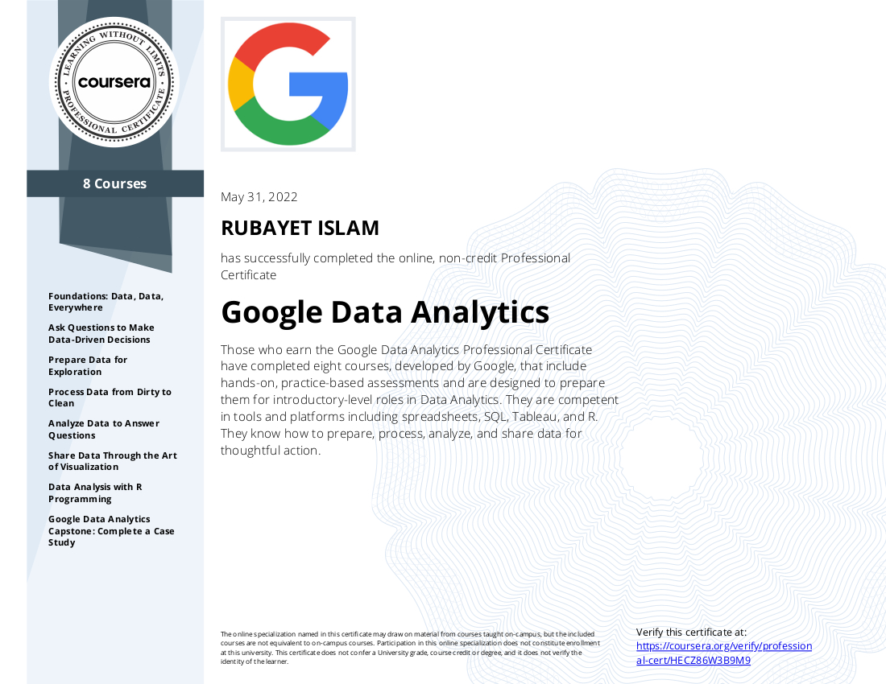

# Google Data Analytics Professional Certificate Capstone Project

This repository consists of capstone project from Google Data Analytics Professional Certificate Course offered by Coursera. These projects are form "Track 1" of the module i.e. these offer specific data sets to analyze. Currently, two different scenario/case studies have been analyzed here. 

## Cyclistic: How does a bike-share company navigate speedy success?

First one, a bike sharing company, Cyclistic, is looking for usage pattern between the membership types of its users, in order to make more profit to encourage casual users to convert into annual membership subscription. Details of this analysis report can be found [here](./Google_DA_Capstone_Cyclistic_Case_Study/Cyclistic_How_does_bike-share_company_navigate_speedy_success.md).

## Bellabeat: How can a wellness company play it smart?

On the other hand, Bellabeat, a wellness company, is looking for patterns of usage of fitness tracker to improve on the features they provide and make positive impact on the users' fitness scenario. Details of this analysis report can be found [here](./Google_DA_Capstone-Bellabeat_Case_Study/Case_study_Bellabeat-How_can_a_wellness_company_play_it_smart.md).

## Certificate of Completion

